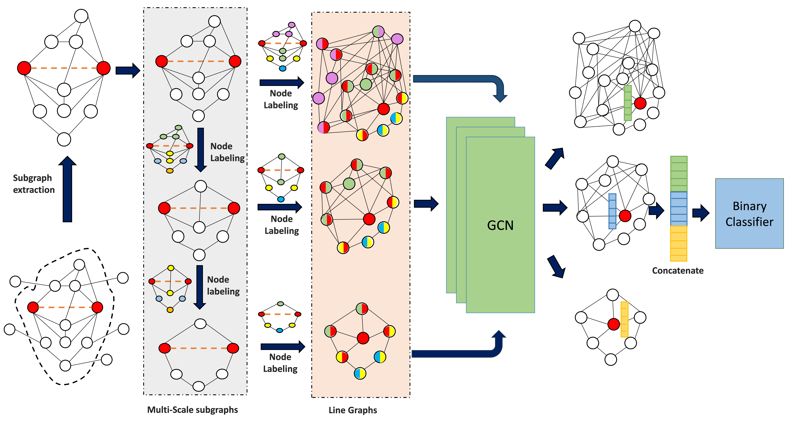

# MLGLP
Multi-Scale Line Graph Link Prediction




# Introduction
This repository provides the official PyTorch implementation of the research paper Multi-Scale Line Graph Link Prediction. 


# Training and Evaluating
To run MLGLP on dataset "Power", with test ratio=0.2 and maximum train number=100000, just type

```sh
!python Main.py --data-name=Power --test-ratio=0.2 --max-train-num=100000

```
# Acknowlegdements
Portions of the code are adapted from the outstanding work available at  https://github.com/divelab/LGLP . We are grateful for their exceptional work!
